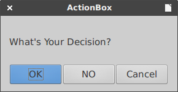

# unodit
**UNO** **Di**alog **T**ools (alpha version) automate some of the tedious tasks with dialogs in order to help you write your own extension for LibreOffice.

Use this library to prepare your python script with dialogs as extension for LibreOffice or embed in document. Newcomers would benefit from reading generated code (see `examples` directory) or writing macros with simple dialog boxes for interaction with a user.

`unodit` main features are:

1. Convert dialog
    - takes a dialog file created with Dialog Editor (`.xdl`)
    - generate dialog in python code, 
    - create callback functions for all button onClick events
    - create script extension for LibreOffice (`.oxt`) with
      menu-item in `Tools - AddOns` menu
2. Connect to dialog
    - takes a dialog file (`.xdl`) in dialog library
    - generate python code to connect with dialog and 
    - create callback functions for all button onClick events
3. Embed dialog
    - takes a dialog file created with Dialog Editor (`.xdl`)
    - generate dialog in python code, 
    - create callback functions for all button onClick events
    - embed dialog in ODF document
4. Simple dialog boxes 
    - provides a simple dialog boxes for interaction with a user
        - make choices (SelectBox, OptionBox) 
        - enter new data (TextBox, NumberBox, DateBox) 
        - get paths (FolderPathBox, FilePathBox)
        - show information (MessageBox)
        - make a decision (ActionBox)
    - in script interactions are invoked by simple function calls 
    - create script extension for LibreOffice (`.oxt`)
5. Convert dialogs in sidebar (work in progress)
    - takes a dialog file created with Dialog Editor (`.xdl`)
    - generate dialog in python code, 
    - create callback functions for all button onClick events
    - create sidebar extension for LibreOffice (`.oxt`)

Other features are:
- all steps are logged to `log.log` file in project root
- per project customization with ini file (copy `config.ini` in project root)
- boilerplate code in `templates` directory
- conversion `.xdl` to `.py` defined in `schema.py`
- diff `.xdl` vs. `schema.py`

Your comments, feedback and patches are welcomed and appreciated.

NOTE:
I'm not a programmer and English is not my native language.
This is a project that targets LibreOffice 5+ and Python3 (Apache OpenOffice patches are welcomed).
Tested with Xubuntu 16.04. and LibreOffice 5.1*.

##Installation

Place the unodit directory somewhere on your Python path.

##Usage
    python3 ./unodit.py [-f ] [-d] [-a] [-m] [-i] [-p]
    
f  - full path to the xdl file

d - full path to the output directory (project root)

a - application name

m - mode

i - number of spaces used for indentation in the generated code. If 0, \t is used as indent

p - number of panels in deck

##Customization 
You can copy `config.ini` in your project root directory. Edit section in `my_project_dir/config.ini` file to make changes.

##Examples
Create python project directory `TestLib` in `LIBREOFFICE_PATH/4/user/Scripts/python/`.

Replace `LIBREOFFICE_PATH` with actual path.

###Convert XDL file to python code and create extension

Use parameter `-f` to set the path to **any** local directory with `xdl` file.

    python3 ./unodit.py -f 'LIBREOFFICE_PATH/4/user/basic/DialogLib/Default.xdl'
                        -d 'LIBREOFFICE_PATH/4/user/Scripts/python/TestLib'
                        -a 'Test_convert'
                        -m 'script_convert'

Available options for parameter -m: `'script_convert'` , `'script_files'` , `'script_oxt'` , `'script_all'`

|Parameter|Description|Note|
|---------|------------|----|
|`'script_convert'`|convert `xdl` file|write your code in `src/Test_convert.py`|
|`'script_files'`|create script extension files|change `description.txt`, `title.txt` and `license.txt`|
|`'script_oxt'`|create script extension      |extension file `Test_convert_Devel.oxt`|
|`'script_all'`|all in one - testing|convert `xdl` file + create script extension files + script extension|

**Directory structure and parameters**

    TestLib/
            src/
                Test_convert.py           script_convert
                pythonpath/
                    Test_convert_UI.py   ---------------       
            META-INF/
                manifest.xml
            description/
                description.txt           script_files
                title.txt
            registration/
                license.txt
            Addons.xcu
            description.xml              --------------
            Test_convert_Devel.oxt        script_oxt
            
           

###Connect to XDL file with python code

Create dialog `Default.xdl` in dialog project `DialogLib` in My Macros (`Tools - Macros - Organize Dialogs - Dialogs - My Dialogs`)
    
    python3 ./unodit.py -f 'LIBREOFFICE_PATH/4/user/basic/DialogLib/Default.xdl'
                        -d 'LIBREOFFICE_PATH/4/user/Scripts/python/TestLib''
                        -a 'Test_connect'
                        -m 'connect'
               
Available options for parameter `-m`: `'connect'`.

|Parameter|Description|Note|
|---------|------------|----|
|`'connect'`|connect to `xdl` file|write your code in `src/Test_connect.py`|

**Directory structure**

    TestLib/
            src/
                Test_connect.py 

###Convert XDL file to python code and embed in document

Use parameter `-f` to set the path to **any** local directory with `xdl` file.
Place ODF document `Text document.odt` in  project dir (tested with Writer).

    python3 ./unodit.py -f 'LIBREOFFICE_PATH/4/user/basic/DialogLib/Default.xdl'
                        -d 'LIBREOFFICE_PATH/4/user/Scripts/python/TestLib'
                        -a 'Test_embed'
                        -m 'embed_convert'

Available options for parameter `-m`: `'embed_convert'`, `'embed_pack'`, `'embed_all'`

|Parameter|Description|Note|
|---------|------------|----|
|`'embed_convert'`|convert `xdl` file|write your code in `src/Test_embed.py`|
|`'embed_pack'`|pack     |pack macro in `Text document_MACRO.odt`|
|`'embed_all'`|all in one - testing|embed_convert + embed_pack|

**Directory structure and parameters**

    TestLib/
            Text document.odt
            src/                          embed_convert
                Test_embed.py            --------------
            Text document_MACRO.odt       embed_pack

###Provides a simple dialog boxes for scripts

    python3 ./unodit.py -d 'LIBREOFFICE_PATH/4/user/Scripts/python/TestLib'
                        -a 'Test_dialogs'
                        -m 'dialogs_create'
                        
Available options for parameter `-m`: `'dialogs_create'`, `'dialogs_files'`, `'dialogs_oxt'`, `'dialogs_all'`

|Parameter|Description|Note|
|---------|------------|----|
|`'dialogs_create'`| create files|write your code in `src/Test_dialogs.py`|
|`'dialogs_files'`|create script extension files|change `description.txt`, `title.txt` and `license.txt`|
|`'dialogs_oxt'`|create script extension|extension file `Test_dialogs_Devel.oxt`|
|`'dialogs_all'`|all in one - testing|dialogs_create + dialogs_files + dialogs_oxt|

**Directory structure and parameters**

    TestLib/
            src/
                Test_dialogs.py           dialogs_create
                pythonpath/
                    simple_dialogs.py    ---------------       
            META-INF/
                manifest.xml
            description/
                description.txt           dialogs_files
                title.txt
            registration/
                license.txt
            Addons.xcu
            description.xml              --------------
            Test_dialogs_Devel.oxt        dialogs_oxt

####Dialogs

All dialogs are defined in `simple_dialogs.py`. In order to use dialog eg. `SelectBox` in your script `Test_dialogs.py` import it:

    from simple_dialogs import SelectBox

GUI operations are a simple a matter of invoking SelectBox functions with a few parameters
    
    s = SelectBox(message="Select your favorite city", title="My choice", choices=["New York","London", "Paris", "Berlin"])
    print(s)

Generate files with option `'dialogs_create'` and read `Test_dialogs.py` for more information.
 

#####SelectBox 

Usage: SelectBox(message="Select one item", title="SelectBox", choices=['a','b','c'])

Return: a string, or `None`

#####OptionBox

Usage: OptionBox(message="Select multiple items", title="OptionBox", choices=['a','b','c'])

Return: a tuple of selected items, or empty tuple

#####TextBox
Usage: TextBox(message="Enter your input", title="TextBox", text="")

Return: a string, or `None`

#####NumberBox
Usage: NumberBox(message="Enter a number", title="NumberBox", default_value=0, min_=-10000, max_=10000, decimals=0)

Return: an integer/float or `None`

#####DateBox
Usage: DateBox(message="Date of birth", title="BirthDay")

Return: the selected date in format YYYYMMDD

#####FolderPathBox

Usage: FolderPathBox(title='Get directory path')

Return: the path of a directory or an empty string

#####FilePathBox

Usage: FilePathBox(title='Get file path')

Return: the path of a file or an empty string

#####MessageBox

Usage: MessageBox(message="Message", title="MessageBox")

#####ActionBox

Usage: ActionBox(message="Message", title="ActionBox")

Return: `OK` or `NO` or `Cancel`

###Convert dialogs in sidebar (work in progress)

Create dialogs in Dialog Editor. Copy `conf.ini` in `TestLib` directory. For each created dialog in `conf.ini` file set path to `xdl` file.

    [panel1]
    ...
    xdl_ui = /path/to/my/Dialog1.xdl
    
    [panel2]
    ...
    xdl_ui = /path/to/my/Dialog2.xdl
    
Use parameter `-p` to set number of panels (dialogs) in sidebar

    python3 ./unodit.py -d 'LIBREOFFICE_PATH/4/user/Scripts/python/TestLib'
                        -a 'Test_sidebar'
                        -m 'sidebar_convert'
                        -p 2
                        
Available options for parameter `-m`: `'sidebar_convert'`, `'sidebar_files'`...

|Parameter|Description|Note|
|---------|------------|----|
|`'sidebar_convert'`| create files|write your code in `src/pythonpath/ui_logic/Panel*.py` and `src/Test_sidebar.py`|
|`'sidebar_files'`|create sidebar extension files|change `description.txt`, `title.txt` and `license.txt`|
|`'xxxxxxxxx'`|create sidebar extension|extension file `Test_sidebar_Devel.oxt`|
|`'xxxxxxxxx'`|all in one - testing|dialogs_create + dialogs_files + dialogs_oxt|

**Directory structure and parameters**

    TestLib/
            src/  
                Test_sidebar.py           sidebar_convert
                pythonpath/
                    ui/
                        Panel1_UI.py
                        Panel2_UI.py
                    ui_logic/
                        Panel1.py
                        Panel2.py        ---------------       
            META-INF/
                manifest.xml
            description/
                description.txt           
                title.txt
            registration/
                license.txt               sidebar_files
            image/
                icon.png
            Factory.xcu
            Sidebar.xcu
            ProtocolHandler.xcu
            description.xml              --------------
            Test_sidebar_Devel.oxt        sidebar_oxt

###Installing an extension

If one create a script extension for LibreOffice (oxt file) install it with:

1. Choose Tools - Extension Manager or 

2. Command-line:

   Ubuntu - `/usr/bin/unopkg add ./MyApp_Devel.oxt`

##Unodit directory structure

    unodit/
        
        pythonpath/                    > submodules dir
            config.py                      > config file
            embed_packer.py                > embed script in ODF file
            extractor.py                   > extract context from ui file
            generator.py                   > code generator
            pyuno_generator.py             > python code generator
            schema.py                      > supported properties
            script_oxt_creator.py          > extension creator
            simple_dialogs.py              > like easygui dialogs
        
        resource/                      > resources dir
            dialogs/                       > dialog images
            screanshoot/                   > screanshoot images
        
        templates/                     > tempaltes dir
            connect/
            convert/
            dialogs/
            embeded/
            script_ext/
        
        config.ini                         > config file
        LICENSE.txt
        README.md
        unodit.py                          > main script

##Screenshot

Run macros

Test dialog

Callback function

Run embeded macro in document

##Similar projects

The following is an incomplete lists of a few projects that share some similarity with `unodit`.

[Gladex](https://launchpad.net/gladex): Gladex is a Python application which takes a .glade file written in the Glade User Interface Builder and generates code in Perl, Python, or Ruby.

[pyuic4](http://pyqt.sourceforge.net/Docs/PyQt4/designer.html#the-uic-module): Convert a .ui file written with Qt Designer into a Python script.

[EasyGUI](https://sourceforge.net/projects/easygui): Very easy GUI programming in Python and Tkinter

[EasyGUI_Qt](https://github.com/aroberge/easygui_qt): Inspired by EasyGUI, designed for PyQt

