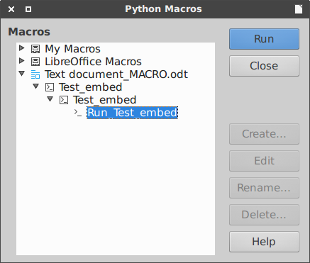

# unodit
**UNO** **Di**alog **T**ools (alpha version) automate some of the tedious tasks with dialogs in order to help you write your own extension for LibreOffice in Python(PyUNO).

Use this library to prepare your python script with dialogs as extension for LibreOffice or embed in document. Newcomers would benefit from reading generated code (see `examples` directory) or writing macros with simple dialog boxes for interaction with a user.

`unodit` main features are:

1. Provides simple dialog boxes for interaction with a user
2. Create extension with dialog
3. Embed dialog in ODF document
4. Create sidebar extension
5. Connect to dialog

Other features are:
- all steps are logged to `log.log` file in project root
- per project customization with ini file (copy `config.ini` in project root)
- boilerplate code in `templates` directory
- conversion `.xdl` to `.py` defined in `schema.py`
- diff `.xdl` vs. `schema.py`

Your comments, feedback and patches are welcomed and appreciated.

NOTE:
I'm not a programmer and English is not my native language.
This is a project that targets LibreOffice 5+ and Python3 (Apache OpenOffice patches are welcomed).
Tested with Xubuntu 16.04. and LibreOffice 5+.

##Installation

Place the unodit directory somewhere on your Python path.

##Usage
    python3 ./unodit.py -m -d [-f ] [-a] [-p] [-i] 
    
m - mode

d - full path to the output directory (project root)

f  - full path to the xdl file

a - application name

p - number of panels in deck

i - number of spaces used for indentation in the generated code. If 0, \t is used as indent

##Quick start

This section gives a general overview, for more information see [documentation](https://github.com/kelsa-pi/unodit/wiki).

- create dialog eg. `Default.xdl` in Dialog Editor
- create project directory eg. `TestLib` in `LIBREOFFICE_PATH/4/user/Scripts/python/`
- run `unodit` to create extension in project directory
 
        python3 ./unodit.py -m 'script_all'
                            -d 'LIBREOFFICE_PATH/4/user/Scripts/python/TestLib'
                            -f 'LIBREOFFICE_PATH/4/user/basic/DialogLib/Default.xdl'
                            -a 'Test_convert'                           

- install extension using Tools - Extension Manager or command-line `/usr/bin/unopkg add ./MyApp_Devel.oxt` (Ubuntu) 

##Screenshot

Test dialog

Callback function

Run macro script

Run macro connect

Run embeded macro in document

##Unodit directory structure

    unodit/
        
        pythonpath/                    > submodules dir
            config.py                      > config file
            embed_packer.py                > embed script in ODF file
            extractor.py                   > extract context from ui file
            generator.py                   > code generator
            pyuno_generator.py             > python code generator
            schema.py                      > supported properties
            script_oxt_creator.py          > extension creator
            simple_dialogs.py              > like easygui dialogs
        
        resource/                      > resources dir
            dialogs/                       > dialog images
            screanshoot/                   > screanshoot images
        
        templates/                     > tempaltes dir
            connect/
            convert/
            dialogs/
            embeded/
            script_ext/
        
        config.ini                         > config file
        LICENSE.txt
        README.md
        unodit.py                          > main script

##Similar projects

The following is an incomplete lists of a few projects that share some similarity with `unodit`.

[Gladex](https://launchpad.net/gladex): Gladex is a Python application which takes a .glade file written in the Glade User Interface Builder and generates code in Perl, Python, or Ruby.

[pyuic4](http://pyqt.sourceforge.net/Docs/PyQt4/designer.html#the-uic-module): Convert a .ui file written with Qt Designer into a Python script.

[EasyGUI](https://sourceforge.net/projects/easygui): Very easy GUI programming in Python and Tkinter

[EasyGUI_Qt](https://github.com/aroberge/easygui_qt): Inspired by EasyGUI, designed for PyQt

